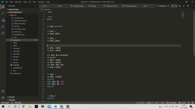

#### How to compile:
```sh
bison -d calc.y
flex tok.l
gcc calc.tab.c lex.yy.c -lfl
```

-------------------
#### How to run the test files :
```sh
./a<tests/double.prog
./a<tests/expressions.prog
./a<tests/Fibonocci.prog
./a<tests/if.prog
./a<tests/Procedure.prog
./a<tests/template.prog

```
> ## Our code can compile the following 
* if
* for
* while
* nested while
* procedures
* print statement
* 


###### The output will be asmb.asm. Load asmb.asm in Mars, assemble and run.
---------------------

1. What is the output? The last expression is the output.

2. Put a nextline character at the end of the last statement. 

3. The condition inside the while loop needs to of atomic nature (var relop var).

#### Below is a sample output file

<br></br>

#### Basic Structure of a Pascal Program

>program {name of the program}
>uses {comma delimited names of libraries you use}
>const {global constant declaration block}
>var {global variable declaration block}
>
>function {function declarations, Procedure any}
>{ local variables }
>begin
>...
>end;
>
>procedure { procedure declarations, if any}
>{ local variables }
>begin
>...
>end;
>
>begin { main program block starts}
>...
>end. { the end of main program block }
